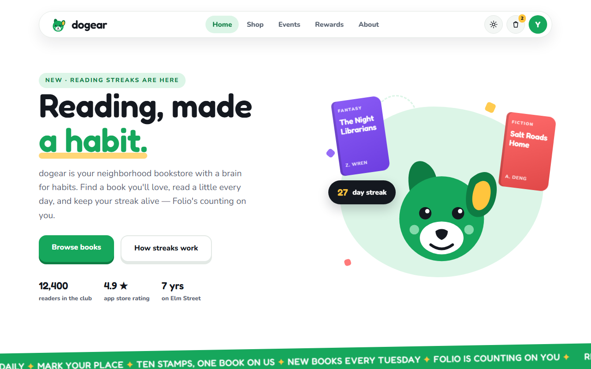
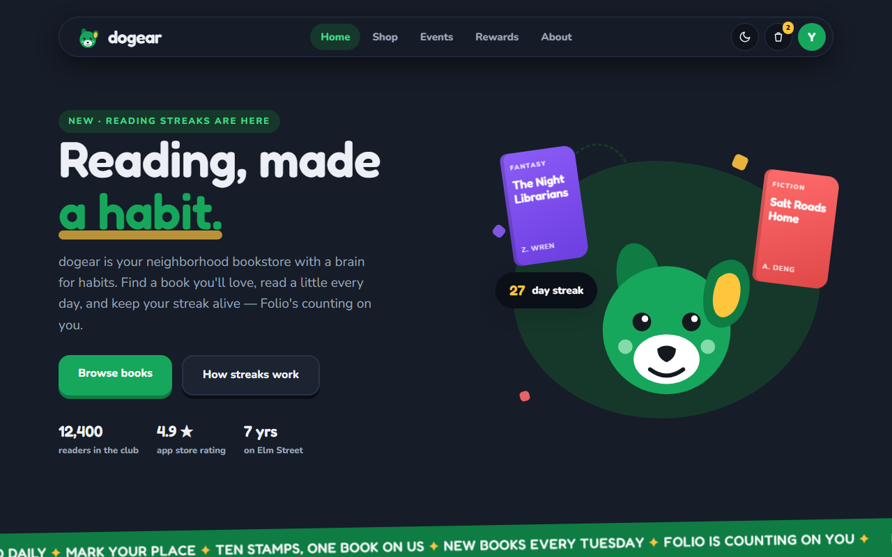
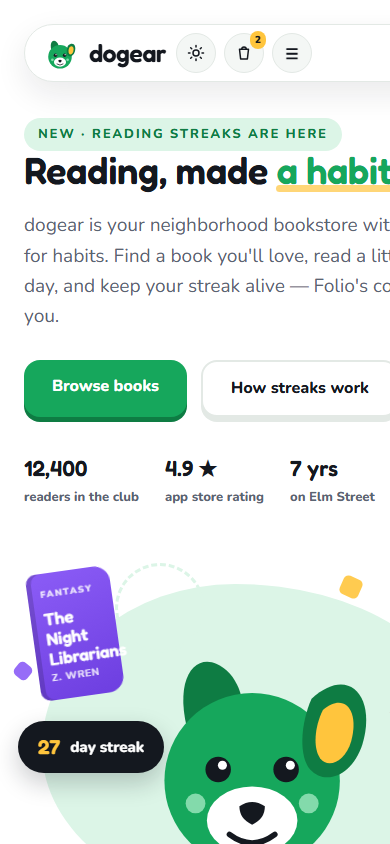
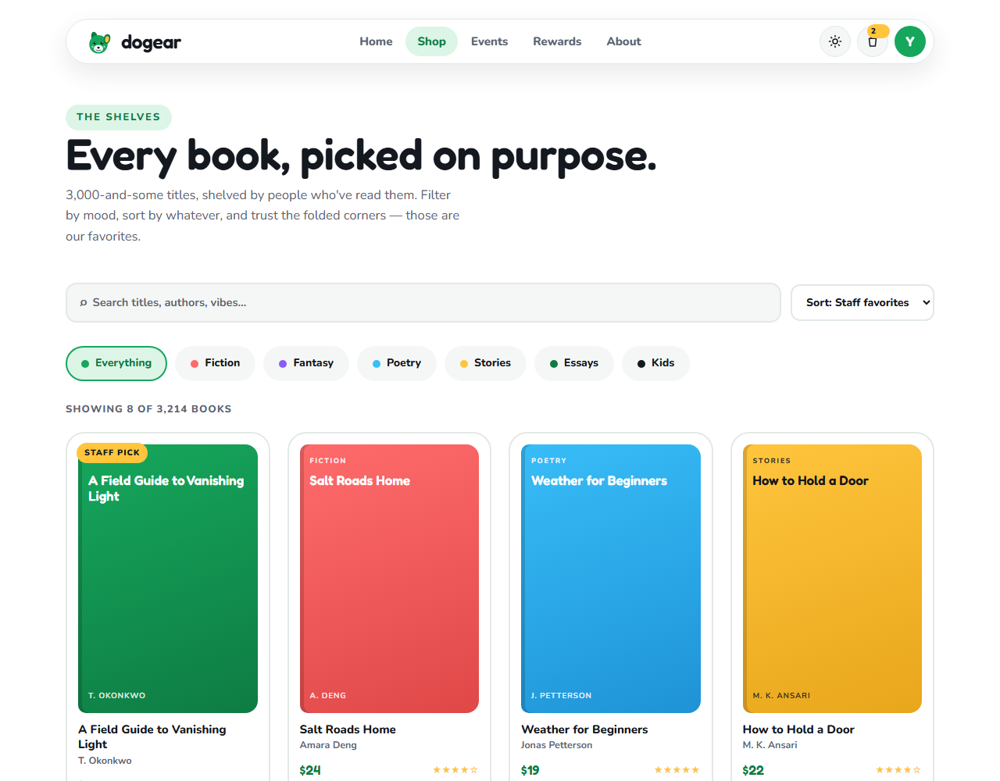
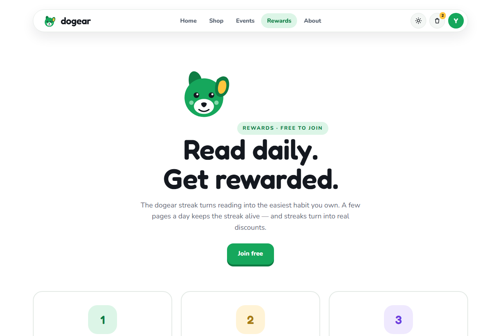
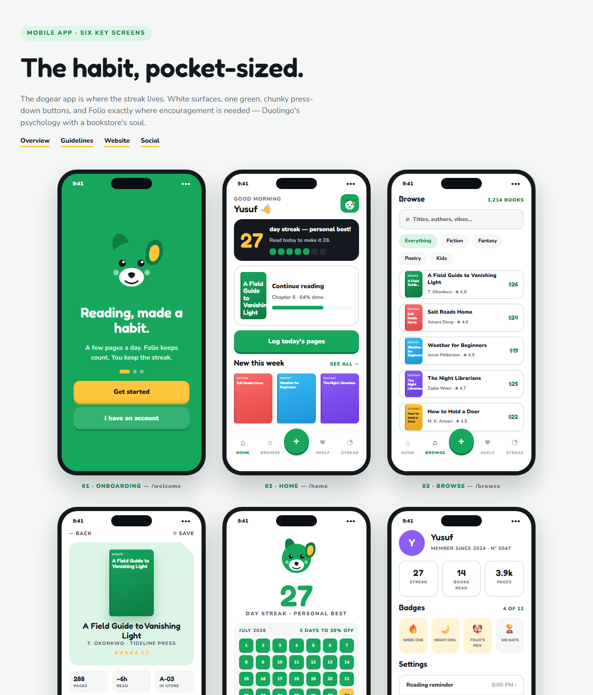
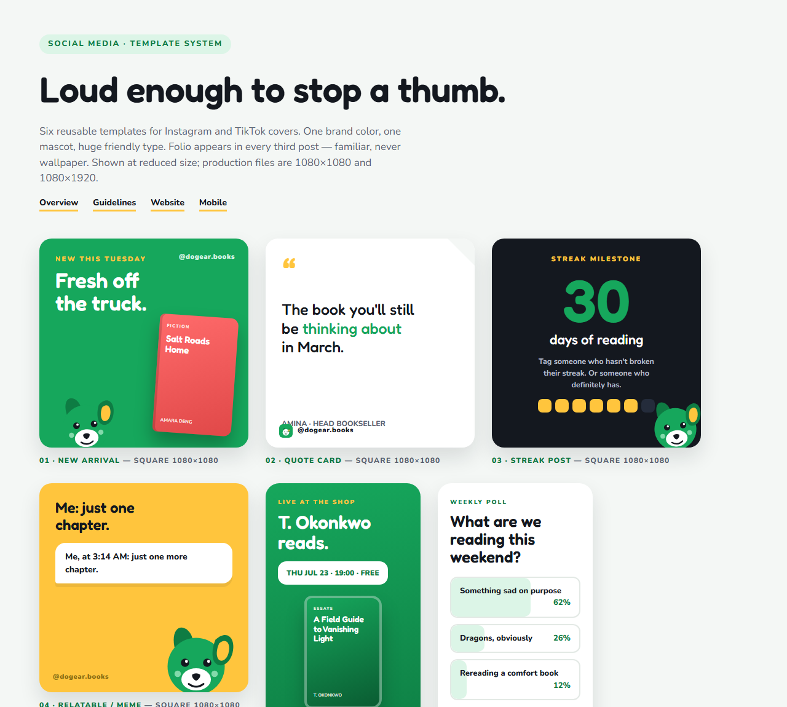
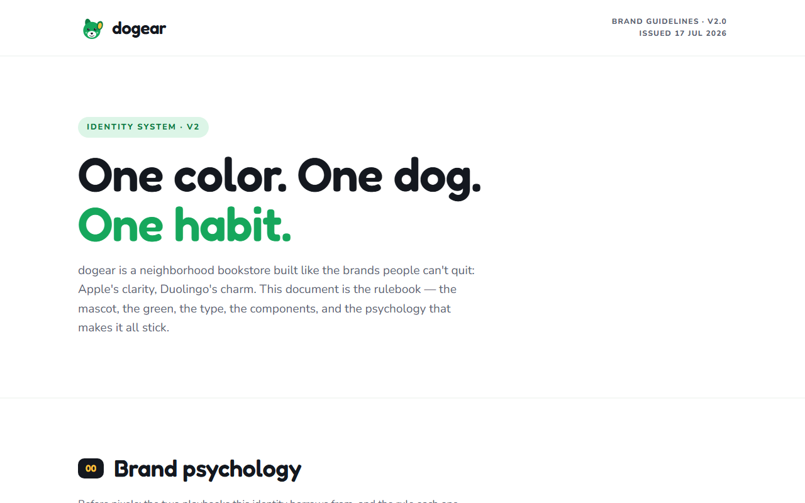
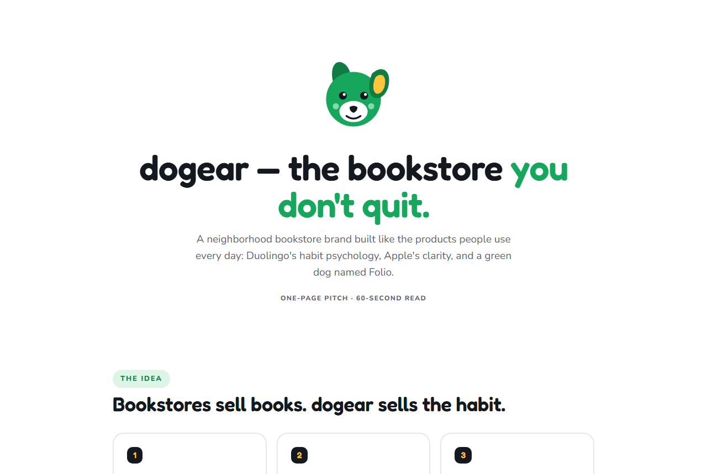
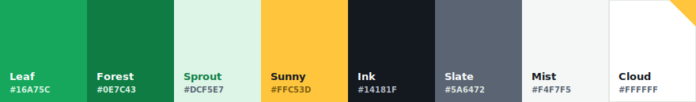

<div align="center">


# dogear - Brand Identity

**A neighborhood bookstore, built like a habit app.**

*Reading, made a habit.*

[](https://yusufabdi6356.github.io/dogear-brand-identity/)
[](dogear-brand-book.pdf)
[](https://www.figma.com/design/AVFwXOwyFmcIKR0vpDCWZ7)

<a href="https://yusufabdi6356.github.io/dogear-brand-identity/website/home.html">
  
</a>

</div>

## Overview

dogear is a brand identity for a neighborhood bookstore that uses the habit-building principles of reading streaks, small rewards, and a friendly mascot. The visual system combines warm editorial character with a clear, focused interface.

| Influence | Applied principle |
|---|---|
| Duolingo | Streaks, rewards, encouraging feedback, and a mascot readers root for |
| Apple | One idea per screen, confident typography, generous space, and a disciplined color palette |

## Website

The responsive website has nine pages and a shared design system:

| Page | Purpose |
|---|---|
| [Home](website/home.html) | Landing page, new books, events, and the reading streak |
| [Shop](website/shop.html) | Searchable, filterable book catalog |
| [Book](website/book.html) | Book details, saved items, and related reads |
| [Events](website/events.html) | Upcoming events and RSVP interactions |
| [Rewards](website/rewards.html) | Reading streaks, milestones, and progress logging |
| [Cart](website/cart.html) | Bag quantities, removals, and live totals |
| [About](website/about.html) | Store story, team, and visit information |
| [Sign in](website/signin.html) | Returning reader account entry |
| [Sign up](website/signup.html) | New reader registration flow |

## Visual gallery

### Responsive website

<table>
  <tr>
    <td align="center" width="33%"><a href="https://yusufabdi6356.github.io/dogear-brand-identity/website/home.html"></a><br><b>Home</b></td>
    <td align="center" width="33%"><a href="https://yusufabdi6356.github.io/dogear-brand-identity/website/home.html?theme=dark"></a><br><b>Dark mode</b></td>
    <td align="center" width="33%"><a href="https://yusufabdi6356.github.io/dogear-brand-identity/website/home.html"></a><br><b>Mobile layout</b></td>
  </tr>
  <tr>
    <td align="center" colspan="2"><a href="https://yusufabdi6356.github.io/dogear-brand-identity/website/shop.html"></a><br><b>Shop</b></td>
    <td align="center"><a href="https://yusufabdi6356.github.io/dogear-brand-identity/website/rewards.html"></a><br><b>Rewards</b></td>
  </tr>
</table>

### Brand deliverables

<table>
  <tr>
    <td align="center" width="50%"><a href="https://yusufabdi6356.github.io/dogear-brand-identity/mobile-design.html"></a><br><b>Mobile app concept</b></td>
    <td align="center" width="50%"><a href="https://yusufabdi6356.github.io/dogear-brand-identity/social-media.html"></a><br><b>Social media system</b></td>
  </tr>
  <tr>
    <td align="center" width="50%"><a href="https://yusufabdi6356.github.io/dogear-brand-identity/brand-guidelines.html"></a><br><b>Brand guidelines</b></td>
    <td align="center" width="50%"><a href="https://yusufabdi6356.github.io/dogear-brand-identity/pitch.html"></a><br><b>Project pitch</b></td>
  </tr>
</table>

### Interface features

- Responsive floating navigation with a single **Sign in / Sign up** account button
- Accessible mobile menu, including keyboard and backdrop close behavior
- Light and dark themes saved in local storage
- Search, category filters, and sorting for the book catalog
- Interactive cart controls, saved books, event RSVPs, streak logging, and newsletter feedback
- Client-side sign-in and sign-up experience with native form validation

## Social media system

<div align="center">
  <a href="https://yusufabdi6356.github.io/dogear-brand-identity/social-media.html">
    
  </a>
</div>

The social system turns the brand into a consistent, recognisable feed. It includes reusable square-post and story layouts for staff picks, reading streaks, events, quotes, new arrivals, and Folio moments.

- **Feed rhythm:** green, white, dark, then Sunny yellow keeps the grid varied but recognisable.
- **Folio cadence:** the mascot appears at least every third post to make the brand feel personal and encouraging.
- **Format-ready:** templates are designed to adapt to both feed and story content without losing the visual system.

[Open the social media templates](https://yusufabdi6356.github.io/dogear-brand-identity/social-media.html)

## Brand system



The core palette uses Leaf green for action, Sunny yellow for special moments, and Cloud white for clarity. Fredoka gives the brand its rounded, friendly character; Nunito keeps long-form information highly readable.

- **Folio**: leaf-green mascot with one folded ear
- **Chunky press buttons**: tactile buttons with a darker lower edge
- **The fold**: a Sunny yellow corner fold that marks something special
- **The streak**: daily reading rewards at 7, 30, and 100 days

## Next-level opportunities

The current project is a polished front-end concept. These additions would turn it into a stronger product experience:

1. **Real reader accounts** - connect sign-in and sign-up to a secure auth provider so saved books, carts, and streaks follow readers across devices.
2. **Personalised discovery** - use genres, saves, and reading progress to create a focused "For your next chapter" shelf instead of a generic catalog.
3. **A true checkout flow** - add pickup or delivery selection, promo/reward redemption, payment, and a reassuring confirmation screen.
4. **Meaningful streak support** - introduce reminders, a visible streak-freeze balance, milestone celebrations, and an optional weekly reading goal.
5. **Community momentum** - let readers RSVP, add events to their calendar, share a book club status, and see which local events are filling up.
6. **Content operations** - connect books, events, and social templates to a small CMS so the team can keep the site current without editing code.
7. **Measurement and iteration** - track discovery-to-save, save-to-cart, and streak completion journeys to refine the paths that most help readers return.

## Additional deliverables

| Item | Link |
|---|---|
| Live site | [Open the demo](https://yusufabdi6356.github.io/dogear-brand-identity/) |
| Package hub | [index.html](index.html) |
| Brand guidelines | [brand-guidelines.html](brand-guidelines.html) |
| Brand book | [dogear-brand-book.pdf](dogear-brand-book.pdf) |
| Mobile app concept | [mobile-design.html](mobile-design.html) |
| Social templates | [social-media.html](social-media.html) |
| Logo suite | [logo/](logo) |

## Run locally

No build step is required. This project is plain HTML, CSS, JavaScript, and SVG.

```bash
git clone https://github.com/Yusufabdi6356/dogear-brand-identity.git
cd dogear-brand-identity
npx http-server . -p 8080
```

Then open `http://localhost:8080` in a browser.

## Project structure

```text
.
|- index.html                 Package hub
|- brand-guidelines.html      Brand rules and rationale
|- dogear-brand-book.pdf      Clickable brand book
|- logo/                      Logos, mascot, and favicon
|- screenshots/               README previews
`- website/                   Responsive website
   |- styles.css              Shared design system
   |- theme.js                Shared interactions
   `- *.html                  Website and account pages
```

<div align="center">

Designed by [Yusuf Abdi](https://github.com/Yusufabdi6356)

*Reading, made a habit.*

</div>
