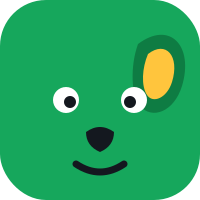

<div align="center">


# dogear — Brand Identity

**A neighborhood bookstore, built like a habit app.**
*Reading, made a habit.* 🐶📚

[](https://yusufabdi6356.github.io/dogear-brand-identity/)
[](dogear-brand-book.pdf)
[](https://www.figma.com/design/AVFwXOwyFmcIKR0vpDCWZ7)

<a href="https://yusufabdi6356.github.io/dogear-brand-identity/website/home.html">
  
</a>

*Click any screenshot in this README to open the real, live page.*

</div>

---

## 🌗 Light & dark, one click

Every website page ships with a **floating pill navbar** — logo, centered links, and an icon
cluster (theme toggle · bag · avatar) — plus a full **dark theme**: toggle it with the ☀/☾
button, and your choice is remembered. You can even link a theme directly with `?theme=dark`.

<div align="center">
  <a href="https://yusufabdi6356.github.io/dogear-brand-identity/website/home.html?theme=dark">
    
  </a>
</div>

---

## 💡 The idea

People love **buying** books and struggle to **read** them. A bookstore's real competitor isn't
Amazon — it's the phone at 9pm. Habit apps solved this with streaks, mascots, and tiny daily
wins, so **dogear** applies that psychology to a bookstore:

| Borrowed from | The rule it gives us |
|---|---|
| 🦉 **Duolingo** | A mascot people root for, habit loops (the reading **streak**), tactile chunky UI, a voice of *cheerful menace* |
| 🍎 **Apple** | One idea per screen, huge confident type, white space as luxury, one disciplined accent color |

The name comes from the **dog-ear** — the folded page corner readers use to mark their place.
The mascot, **Folio**, is a leaf-green dog whose one folded ear (lined in sunny yellow) *is* the logo.

---

## 🎨 The identity

### Color — one green, disciplined


**Leaf** means action and progress. **Sunny** is reserved for what's special — the fold, streaks, stars.
Support colors (Sky `#38BDF8` · Coral `#FF6B6B` · Violet `#8B5CF6`) appear only in small doses on genre chips and book covers.

### Typography

| Role | Face | Why |
|---|---|---|
| Display & wordmark | **[Fredoka](https://fonts.google.com/specimen/Fredoka)** SemiBold | Rounded, chunky, friendly — the `dogear` lowercase wordmark manner |
| Body & UI | **[Nunito](https://fonts.google.com/specimen/Nunito)** 400–900 | Rounded terminals, warm, extremely readable |

### Signature components

- 🐶 **Folio the mascot** — appears wherever motivation is needed, never as wallpaper
- 🔘 **Chunky press buttons** — a 5px darker bottom shadow that physically depresses on click
- 📐 **The fold** — a sunny folded top-right corner marking anything special (one per view)
- 🔥 **The streak** — read daily, keep the chain, earn real discounts (7 → 10%, 30 → 30%, 100 → free book)
- 💊 **Floating pill navbar** — logo, centered links, theme toggle, bag, and avatar in one rounded bar
- 🌗 **Dark mode** — token-driven theme switch, saved to `localStorage`, system-preference aware
- 🎠 **The marquee** — a tilted scrolling green band of brand mantras (auto-disabled for reduced motion)

---

## 🖥️ The website — 7 responsive pages

<table>
  <tr>
    <td align="center" width="50%">
      <a href="https://yusufabdi6356.github.io/dogear-brand-identity/website/shop.html">
        </a>
      <b>Shop</b> — catalog, chips, folded staff picks
    </td>
    <td align="center" width="50%">
      <a href="https://yusufabdi6356.github.io/dogear-brand-identity/website/rewards.html">
        </a>
      <b>Rewards</b> — the streak calendar & milestones
    </td>
  </tr>
</table>

Also in [`website/`](website): **[Home](https://yusufabdi6356.github.io/dogear-brand-identity/website/home.html)** ·
**[Book detail](https://yusufabdi6356.github.io/dogear-brand-identity/website/book.html)** ·
**[Events](https://yusufabdi6356.github.io/dogear-brand-identity/website/events.html)** ·
**[About](https://yusufabdi6356.github.io/dogear-brand-identity/website/about.html)** ·
**[Cart](https://yusufabdi6356.github.io/dogear-brand-identity/website/cart.html)** — all sharing one design system: [`website/styles.css`](website/styles.css)

📱 **Responsive for real:** fluid type via `clamp()`, grids collapse 4 → 3 → 2 columns, heroes stack under
900px, buttons go full-width under 440px — no horizontal scroll at any width (tested 375 / 768 / 1280).

<div align="center">
  
</div>

---

## 📱 The mobile app — where the habit lives

<div align="center">
  <a href="https://yusufabdi6356.github.io/dogear-brand-identity/mobile-design.html">
    
  </a>
</div>

Six screens in device frames — onboarding, home (streak card + continue reading), browse,
book detail, the streak calendar, and profile with badges.

---

## 📣 Social media system

<div align="center">
  <a href="https://yusufabdi6356.github.io/dogear-brand-identity/social-media.html">
    
  </a>
</div>

Six reusable templates (squares + stories) and a **feed rhythm** — green → white → dark → yellow —
so the profile grid reads as one brand. Folio appears at least every third post.

---

## 📕 Deliverables

| What | Where |
|---|---|
| 🌐 **Live site** | [yusufabdi6356.github.io/dogear-brand-identity](https://yusufabdi6356.github.io/dogear-brand-identity/) |
| 🚪 Package hub | [`index.html`](https://yusufabdi6356.github.io/dogear-brand-identity/index.html) — links to everything |
| ⚡ 60-second pitch | [`pitch.html`](https://yusufabdi6356.github.io/dogear-brand-identity/pitch.html) |
| 📖 Brand guidelines | [`brand-guidelines.html`](https://yusufabdi6356.github.io/dogear-brand-identity/brand-guidelines.html) — psychology, mascot rules, color, type, voice |
| 📕 Clickable PDF | [`dogear-brand-book.pdf`](dogear-brand-book.pdf) — 45 pages, linked contents, MENU button on every page |
| 🎨 Figma design system | [Variables, text styles, components & screens](https://www.figma.com/design/AVFwXOwyFmcIKR0vpDCWZ7) |
| 🐶 Logo suite | [`logo/`](logo) — mascot, lockups, app icon, one-color marks, favicon (SVG) |

<details>
<summary><b>📂 Project structure</b></summary>

```
├── index.html               Package hub — start here
├── pitch.html               One-page pitch (60-second read)
├── brand-guidelines.html    The rulebook
├── mobile-design.html       6 app screens in device frames
├── social-media.html        6 post templates + feed rhythm
├── dogear-brand-book.pdf    Everything as one clickable PDF
├── design-brief.md          The design decisions and why
├── logo/                    7 SVGs: mascot, lockups, app icon, mono ×2, favicon
├── screenshots/             The images in this README
└── website/
    ├── styles.css           The shared design system (tokens + components)
    └── home / shop / book / events / rewards / about / cart .html
```
</details>

<details>
<summary><b>🚀 Run it locally</b></summary>

No build step, no frameworks — pure hand-written HTML/CSS/SVG.

```bash
git clone https://github.com/Yusufabdi6356/dogear-brand-identity.git
cd dogear-brand-identity
# open index.html in a browser, or serve it:
npx http-server . -p 8080
```

Fonts load from Google Fonts; offline they fall back to system fonts.
</details>

---

<div align="center">

**A brand identity concept by [Yusuf Abdi](https://github.com/Yusufabdi6356)** · July 2026
All titles, authors, people, and addresses are fictional.



*Reading, made a habit.*

</div>
